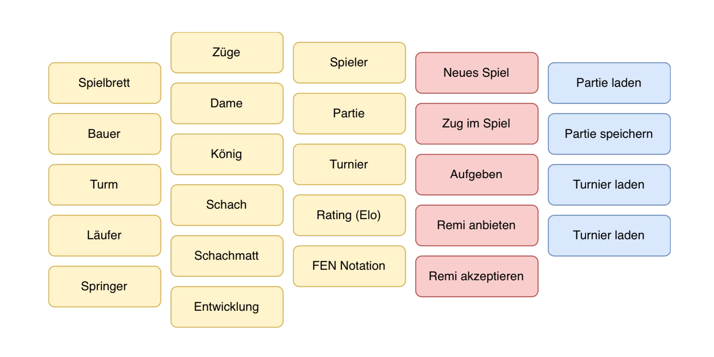

# :chess_pawn: CHESS - HWR OOP Lecture Project [](https://alexinabox.github.io/chess-g4/main/index.html)


This repository contains our (Alex :shipit:, Maja :basecampy:, Felix :penguin:, Gero :octocat:, Laura :bug:) student project created for an ongoing lecture on object-oriented
programming with Java at HWR Berlin (summer term 2024).

> :warning: This code is for educational purposes only. Do not rely on it!

## Prerequisites :octocat:

1. IDE of your choice installed (e.g. IntelliJ IDEA)
2. JDK of choice installed (e.g. through IntelliJ IDEA)
3. Maven installed (e.g. through IntelliJ IDEA)
4. Git installed

## Local Development :fishsticks:

This project uses [Apache Maven][maven] as build tool.

To build from your shell (without an additional local installation of Maven), ensure that `./mvnw`
is executable:

```
chmod +x ./mvnw
```

We recommend not to dive into details about Maven at the beginning.
Instead, you can use [just][just] to build the project.
It reads the repositories `justfile` which maps simplified commands to corresponding sensible Maven
calls.

With _just_ installed, you can simply run this command to perform a build of this project and run
all of its tests:

```
just build
```

## Abstract

Objective of this project is to implement the game Chess while learning object-oriented programming with Java/Kotlin.

:chess_pawn: Chess is a game of skill for two players, each of whom moves 16 figures according to fixed rules across a board consisting 
of an eight-by-eight pattern of squares. Victory depends on concentration and intuitive vision. It is often called the royal game.

The chessboard is a miniature battlefield, and the opposing armies are called white and black. Each consists of eight 
so-called pieces—a king, a queen, two bishops, two knights, and two rooks —and eight pawns. \[...\] The object is to make a successful 
attack upon the enemy king. The king is not actually captured; it is enough to produce a position in which the king cannot escape. 
This situation is called a checkmate and ends the game. [^1]

### Our favourite features

Implementing features like the ELO Rating were very interesting, because we had to sit down and actually do maths to understand the logic. We are very proud of our ELO implementation.

We decided against implementing tournaments, simply because other features seemed more important and interesting to us. If we have had the remaining time we would've included it, sadly we didn't.

## Commands overview

If `chess` does not work in your terminal, try `./chess` or `.\chess` instead.

| Command         | Description           | Example       |
|-----------------|-----------------------|---------------|
| `<ID>`          | Game Id (String)      | 123, testGame |
| `<FROM>`        | Cell coordinates      | a4, c7        |
| `<TO>`          | Cell coordinates      | a4, c7        |
| `<PlayerWhite>` | White Player (String) | Allice        |
| `<PlayerBlack>` | Black Player (String) | Bob           |


| Command                                         | Description                         |
|-------------------------------------------------|-------------------------------------|
| `chess` `chess help`                            | Show the list of supported commands |
| `chess create <ID> <PlayerWhite> <PlayerBlack>` | Start a new chess game              |

### In-Game Commands 

| Command                           | Description                              |
|-----------------------------------|------------------------------------------|
| `chess fen <ID>`                  | Display the FEN notation of a chess game |
| `chess load <ID>`                 | Load a chess game                        |
| `chess move <FROM> <TO> on <ID>`  | Move a chess piece to a valid position   |
| `chess show-moves <FROM> on <ID>` | Get the possible moves for a chess piece |
| `chess resign <ID>`               | Resign the current game                  |
| `chess offer-remi <ID>`           | Offer a remi                             |
| `chess accept-remi <ID>`          | Accept a remi                            |


## Feature List



### Library

| Number | Implemented        | Feature       | Tests              |
|--------|--------------------|---------------|--------------------|
| 1      | :heavy_check_mark: | Chessboard    | :heavy_check_mark: |
| 2.1    | :heavy_check_mark: | ♙ Pawn        | :heavy_check_mark: |
| 2.2    | :heavy_check_mark: | ♖ Rook        | :heavy_check_mark: |
| 2.3    | :heavy_check_mark: | ♗ Bishop      | :heavy_check_mark: |
| 2.4    | :heavy_check_mark: | ♘ Knight      | :heavy_check_mark: |
| 2.5    | :heavy_check_mark: | ♕ Queen       | :heavy_check_mark: |
| 2.6    | :heavy_check_mark: | ♔ King        | :heavy_check_mark: |
| 3      | :heavy_check_mark: | Movement      | :heavy_check_mark: |
| 4      | :heavy_check_mark: | Check         | :heavy_check_mark: |
| 5      | :heavy_check_mark: | Checkmate     | :heavy_check_mark: |
| 6      | :heavy_check_mark: | Development   | :heavy_check_mark: |
| 7      | :heavy_check_mark: | Player        | :heavy_check_mark: |
| 8      | :heavy_check_mark: | Game          | :heavy_check_mark: |
| 9      | :x:                | Tournament    | :x:                |
| 10     | :heavy_check_mark: | Rating (ELO)  | :heavy_check_mark: |
| 11     | :heavy_check_mark: | FEN Notation  | :heavy_check_mark: |

### User Interface

| Number | Implemented        | Feature     | Tests              |
|--------|--------------------|-------------|--------------------|
| 1      | :heavy_check_mark: | New Game    | :heavy_check_mark: |
| 2      | :heavy_check_mark: | Move Piece  | :heavy_check_mark: |
| 3      | :heavy_check_mark: | Resign      | :heavy_check_mark: |
| 4      | :heavy_check_mark: | Offer Remi  | :heavy_check_mark: |
| 5      | :heavy_check_mark: | Accept Remi | :heavy_check_mark: |

### Persistence

| Number | Implemented        | Feature         | Tests              |
|--------|--------------------|-----------------|--------------------|
| 1      | :heavy_check_mark: | Load Game       | :heavy_check_mark: |
| 2      | :heavy_check_mark: | Save Game       | :heavy_check_mark: |

## Additional Dependencies

| Number | Dependency Name | Dependency Description                                                    | Why is it necessary?                                                |
|--------|-----------------|---------------------------------------------------------------------------|---------------------------------------------------------------------|
| 1      | org.mockito     | The Mockito library enables mock creation, verification and stubbing.[^2] | To precisely control the conditions under which the unit is tested. |


[maven]: https://maven.apache.org/
[just]: https://github.com/casey/just
[^1]: https://kids.britannica.com/students/article/chess/273625
[^2]: https://javadoc.io/doc/org.mockito/mockito-core/latest/org/mockito/Mockito.html
